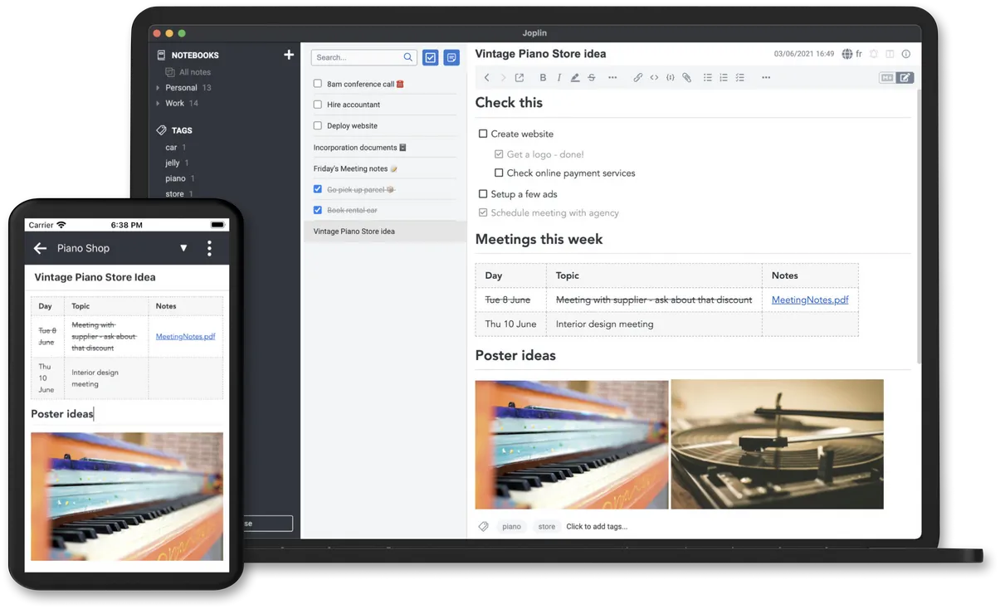

## What's Joplin?
[Joplin](https://joplinapp.org/) is an awesome note taking app that ticks all the right boxes:
1. **It's FOSS**: Joplin is free and [open source](https://github.com/laurent22/joplin/)
2. **Markdown Support**: It utilizes markdown for note-taking, providing a clean and efficient writing format.
3. **Versatile Syncing Options**: Joplin offers multiple ways to sync notes between devices, including official cloud options and self-hosting.
4. **Cross-Platform Sync Availability**: It's officially available on all platforms.
5. **Minimal Design**: With a minimal design, Joplin minimizes distractions



## Syncing Joplin across devices

There are many ways to sync Joplin; some options include Joplin Cloud (official), Dropbox, OneDrive, Nextcloud, and hosting your own Joplin Cloud instance. The one that I prefer is using S3 Object Storage from [Oracle Cloud](https://www.oracle.com/cloud/), as I already have a free account with a 10Gig limit.

Joplin also offers the option to encrypt notes before syncing. Please check [here](#enable-encryption---optional) for more information

### Joplin Sync Setup using S3 Object Storage (Cloud)

- Before setting up syncing, you need to set up an S3 Object Storage bucket and gather a few things:
	1. S3 bucket name
	2. S3 Object storage URL
	3. S3 Region id
	4. Access and secret keys to access your S3 bucket
- Go to your S3 Object Storage provider, in my case, Oracle, and create an S3 bucket. Note down the bucket name/id. Alternatively, you can host your own [S3 Object Storage](https://min.io/)
	- In Oracle, go to Object Storage and Create Bucket.
- Some providers offer an S3 Object Storage URL directly from their portal. However, in my case, I had to manually obtain the bucket namespace and region and fill them into the following URL:
	- I got my `<bucketnamespace>` from Tenancy details and `<region>` from account details.
```nginx
https://<bucketnamespace>.compat.objectstorage.<region>.oraclecloud.com
```
- The S3 region id should be available somewhere on the provider's portal; otherwise, reach out to the provider for it.
- Create access and secret keys to access your S3 storage from the provider's portal.
	- I created mine from going to Profile settings -> Customer Secret Keys (on left of the settings page).
- Now, input those details you obtained into Joplin
	- Go to Tools -> Options -> Synchronization
	- Set the Synchronization Target as `S3 (Beta)`
	- Furnish the details.
- For OCI (Oracle) S3 Object Storage, enable `Force path style`
	- Experiment with enabling and disabling Force path style and clicking `Check synchronization` configuration. One of those should work if everything is correct, as shown below.


- Click `Apply`


Your Joplin sync is set up! Now, save the S3 details somewhere secure and fill in the same details on the machine you want to sync with.

### Enable Encryption - Optional
For those concerned about privacy, enable **Encryption!**. Follow these steps:
- Go to Tools -> Options -> Encryption
- Click `Enable Encryption` and enter a touch and secure **Master Password** twice.
- Note down the **Master Password**  along with S3 storage details and apply it on other machines you want to sync.


Now, your notes should be end-to-end encrypted before syncing.


## References
- [Joplin S3 Sync Documention](https://joplinapp.org/help/apps/sync/s3/)
