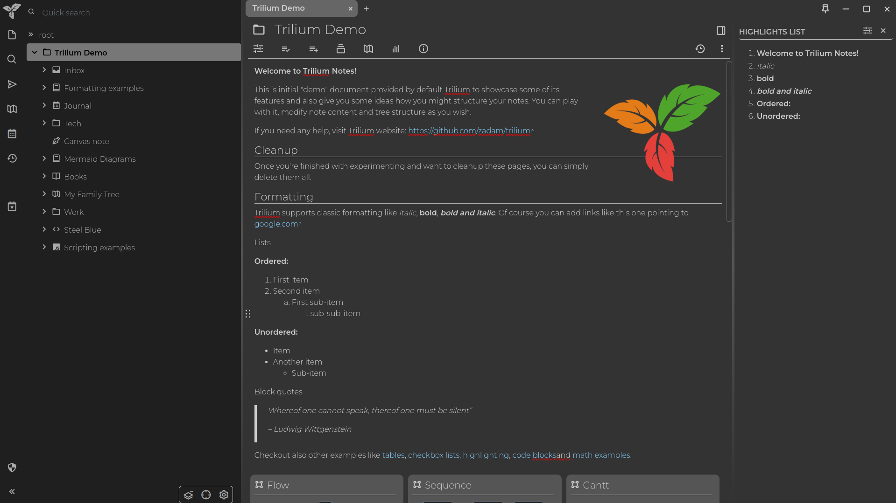
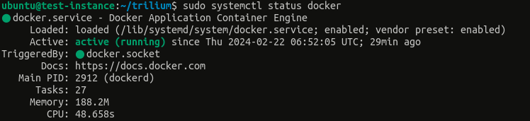
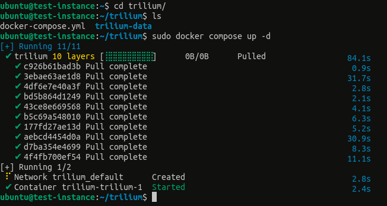
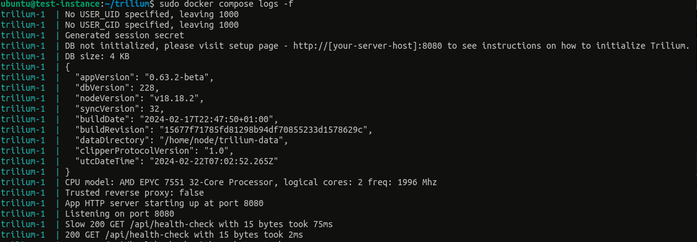
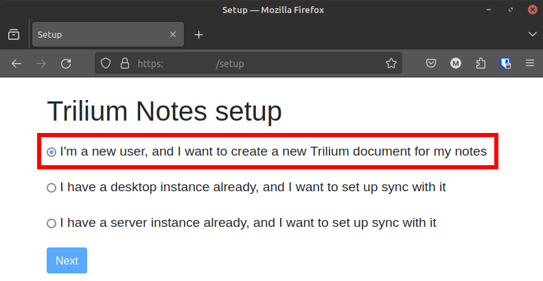
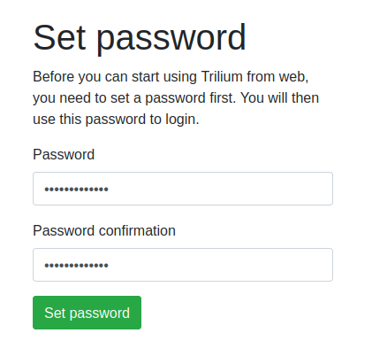
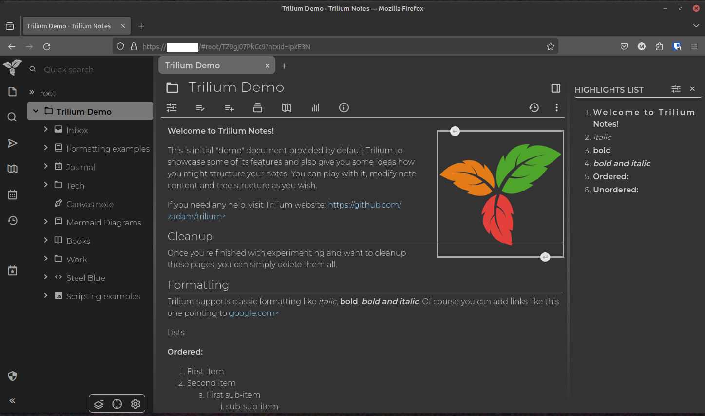
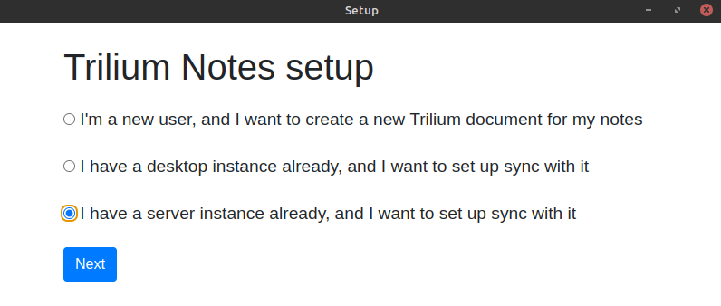
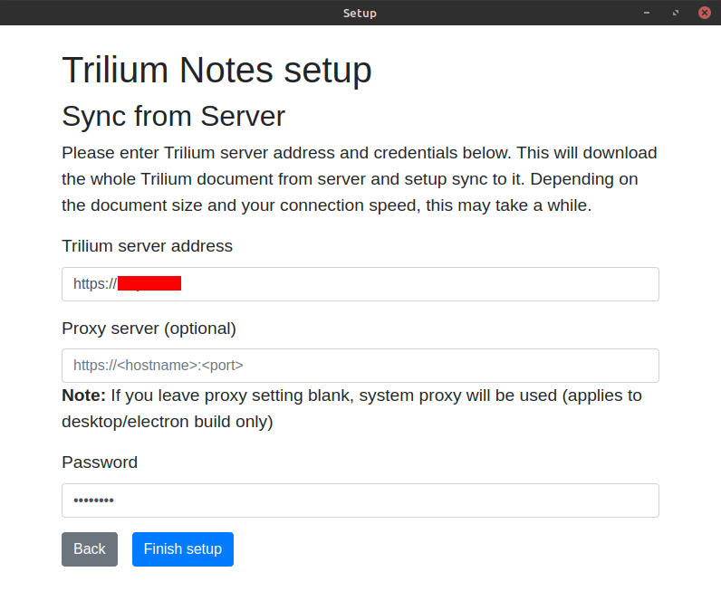
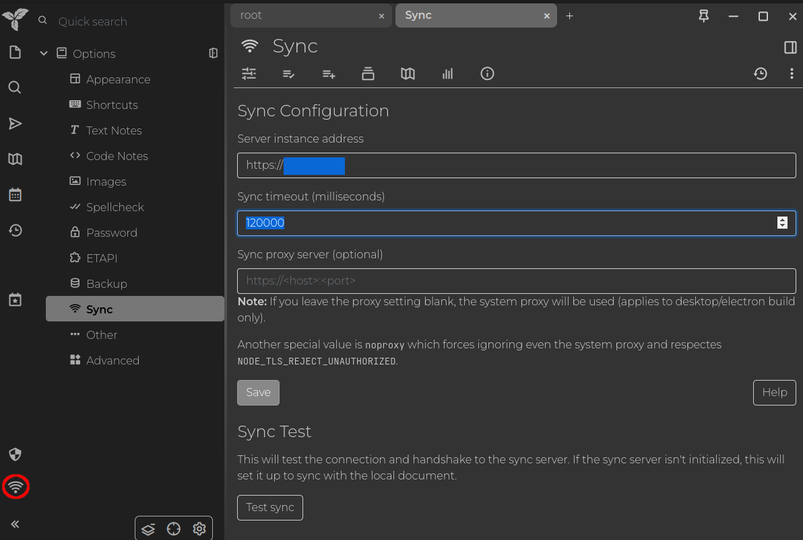

Are you looking for a note taking app that can be self hosted? Allow me to introduce Trilium Notes

## Trilium Notes

Trilium Notes is an open-source hierarchical note-taking app designed as a web app using Electron. It is available both as a desktop app (for Windows and Linux) and as a self-hosted web app.

Trilium Notes checks all the right boxes in terms of features, including, but not limited to, rich WYSIWYG note editing, support for tables, math, Markdown integration, code highlighting, note link maps, note-level encryption support, versioning, canvas support, Mermaid Diagram, and many more. Sounds awesome, right?



So, let's dive into hosting it on Oracle Cloud and setting up sync with a desktop app.

## Hosting Trilium on Oracle's Free Forever VM
### 1 Oracle Account Setup
At the time of writing this guide, Oracle offers a generous Free Tier cloud service claimed to be 'Free Forever.' There are two different configurations under this tier:
1. 2 x AMD Single Core Compute VMs with 1 Gig RAM
2. 1 x ARM Ampere A1 Compute VM with 3000 CPU hours.

For this guide, I'll be using the AMD 1 x Core 1Gig Instance. You can also opt for the latter option for more performance.
If you don't have a free Oracle "Free Forever" Cloud account, create one from [here](https://www.oracle.com/cloud/free/). You'll need a Credit Card to signup for verification.
### 2 Create VM Instance
- Once signed up for Oracle Cloud, create a new Compute Instance with an SSH public key. For more information, check [here](https://docs.oracle.com/iaas/Content/Compute/Tasks/accessinginstance.htm).
	- Use the Ubuntu 22.04 Image.
    - Choose either AMD or Ampere Instance.
- Once your VM is up, log in to that VM using either Linux ssh command or Putty on Windows.  For more information, check [here](https://docs.oracle.com/iaas/Content/Compute/Tasks/accessinginstance.htm).
### 3 Pull and Run Trilium Docker Image
- **Install Docker** -  Run the below commands one by one to install docker.
```bash
sudo apt update
sudo apt install apt-transport-https ca-certificates curl software-properties-common -y
curl -fsSL https://download.docker.com/linux/ubuntu/gpg | sudo gpg --dearmor -o /usr/share/keyrings/docker-archive-keyring.gpg
echo "deb [arch=$(dpkg --print-architecture) signed-by=/usr/share/keyrings/docker-archive-keyring.gpg] https://download.docker.com/linux/ubuntu $(lsb_release -cs) stable" | sudo tee /etc/apt/sources.list.d/docker.list > /dev/null
sudo apt update
sudo apt install docker-ce -y
```
- Verify Docker installation
	- Run `sudo systemctl status docker`
	- If it says that the Docker service is active, then Docker is successfully installed.



- Create a director on your home to store Trilium related files, including notes database.
    - If you want to store Trilium-related files somewhere else, like a separate block volume mounted, you can do that by replacing `~` with the mount path in the below command.
	- Run `mkdir -p ~/trilium/trilium-data && cd ~/trilium`
-  Create a `docker-compose.yml` file and paste the following lines into it.
```yml
version: '3'
services:
  trilium:
    ports:
      - '8080:8080'
    volumes:
      - './trilium-data:/home/node/trilium-data'
    image: 'zadam/trilium:0.63-latest'
    restart: unless-stopped
```
- Run Docker Compose:
	- `sudo docker compose up -d`
	- Now, the Trilium Docker image should be pulled, and a new Docker service called trilium should start.



- Check the logs to see if Trilium is running without any errors, as shown below:
    - `sudo docker compose logs -f`



- Now, you should be able to use curl to get a response from port 8080 using `curl -L localhost:8080`

### 4 Setup a subdomain and Enable HTTPS
Obtain a new subdomain from any of the domains you own and add a DNS record to point that subdomain to the VM's IP. Refer to your domain provider's help section for guidance; it should be free of cost.
#### 4.1 Setup nginx on Ubuntu VM
- Install `nginx` using `sudo apt install nginx -y`
- Create a `/etc/nginx/sites-available/trilium` file with `sudo`
	- `sudo nano /etc/nginx/sites-available/trilium`
- Paste the following lines, but change the server name from `trilium.example.net` to your subdomain address. For example, `trilium.mnjm.tl` where `trilium` is the subdomain, and `mnjm.tl` is the domain.
```nginx
server {
    listen 80;
    listen [::]:80;

    server_name trilium.example.net; #change trilium.example.net to your domain without HTTPS or HTTP.
    location / {
        proxy_set_header Host $host;
        proxy_set_header X-Real-IP $remote_addr;
        proxy_set_header X-Forwarded-For $proxy_add_x_forwarded_for;
        proxy_set_header X-Forwarded-Proto $scheme;
        proxy_set_header Upgrade $http_upgrade;
        proxy_set_header Connection "upgrade";
        proxy_pass http://127.0.0.1:8080; # change it to a different port if non-default is used
        proxy_read_timeout 90;
    }
}
```
- (soft) link `/etc/nginx/sites-available/trilium` to `/etc/nginx/sites-enabled/trilum`
	- `sudo ln -s /etc/nginx/sites-available/trilium /etc/nginx/sites-enabled`
- Reload nginx if the nginx configuration is valid
    - `sudo nginx -t && sudo systemctl reload nginx`
- Now, you should be able to use curl to get a response from port `80` using `curl -L localhost`
#### 4.2 Expose HTTP port (80) and SSL port (443)
Oracle, by default, creates a Virtual Cloud Network (VCN) with all your instances and machines connected. This VCN is protected by a firewall that doesn't allow traffic to and from unknown ports, including ports 80 and 443. An ingress rule needs to be added to allow traffic on these ports. Follow the below steps:
1. Go to your Instance page in Oracle Cloud and click on the subnet link under 'Instance Information'.


2. From there. click on the default security list


3. Add a new Ingress Rule

    - with Source CIDR `0.0.0.0/0`
    - IP Protocol `TCP`
    - Destination Port Range `80`
    - And Description `HTTP`


4. Add another Ingress Rule with the port range set as `443` and `SSL` as the description by following the step mentioned above.

Now expose ports `80` and `443` in Ubuntu's firewall by running the following commands:
```shell
sudo iptables -I INPUT -p tcp --dport 80 -m conntrack --ctstate NEW,ESTABLISHED -j ACCEPT
sudo iptables -I OUTPUT -p tcp --sport 80 -m conntrack --ctstate ESTABLISHED -j ACCEPT
sudo iptables -I INPUT -p tcp --dport 443 -m conntrack --ctstate NEW,ESTABLISHED -j ACCEPT
sudo iptables -I OUTPUT -p tcp --sport 443 -m conntrack --ctstate ESTABLISHED -j ACCEPT
```
Now you should be able to use curl and get a response from your local machine - `curl -L <instance-ip>`

#### 4.3 Enabling HTTPs using Certbot
Certbot is a client that fetches and deploys SSL certificates from Let's Encrypt and other ACME-compliant CAs to your web server. It also automatically generates new certificates upon expiration. We will use the default Let's Encrypt CA to generate an SSL certificate.
- To install Certbot on our Ubuntu instance, run the following commands
```bash
sudo snap install --classic certbot
sudo ln -s /snap/bin/certbot /usr/bin/certbot
```
- Generate the certificate by running `sudo certbot --nginx` and provide the necessary details when asked.
	- Certbot will automatically edit your Nginx configuration to serve it with HTTPS.
	- Verify that the certificate can be renewed with `sudo certbot renew --dry-run`
- Restart the nginx service - `sudo nginx -t && sudo systemctl reload nginx`


Now, the Trilium server should be up and accessible through your browser with HTTPS.


### 5 Trilium Account Setup
- Open the Trilium server in your web browser; you should see the page as shown below.



- Select the first option and proceed to the next step.
- Sign up with a strong password and log in again.



- You should see the Trilium Notes web GUI, as shown below:




Now you take notes using this Trilium server from everywhere!


Now lets install Trilium Desktop and sync it with the server

## Trilium Desktop App
### 1 Installation
- Trilium Desktop is supported on Linux and Windows machines. An unofficial build is available for Mac available [here](https://github.com/zadam/trilium/releases).
- Download the [installer](https://github.com/zadam/trilium/releases) for your operating system from the stable release's assets section.
#### 1.1 On Windows
- Download the installer and install it like any other app
#### 1.2 On Ubuntu and Debian Distro
- Download `.deb` file from the latest stable release's assets section [here](https://github.com/zadam/trilium/releases)
- Open the `.deb` file and install it. Alternatively, you can use `sudo deb -i <deb-file-path>` to install it.
#### 1.3 On Non-Debian Distros
- Download the `.tar.gz`, extract it, and run the `trilium` executable.
- You may add it to your `PATH` shell variable to able to access it from anywhere.
### 2 Syncing it with the server
- When you open Trilium for the first time, it will show three options to start with. Select the third option,  *I have a server instance already...* since we already have a server.



- Enter the Trilium server address and Password that you assigned when setting up the server.




That's it! Your Trilium Desktop app should sync up with the server.

- There should be a sync indicator showing the status of sync on the bottom-left tray



## References
- [Trilium Desktop Installation](https://github.com/zadam/trilium/wiki/Desktop-installation)
- [Syncing to Trilium Server](https://github.com/zadam/trilium/wiki/Desktop-installation)
- [Trilium Docker server install](https://github.com/zadam/trilium/wiki/Docker-server-installation)
- [Nginx proxy setup](https://github.com/zadam/trilium/wiki/Nginx-proxy-setup)
- [Certbot](https://certbot.eff.org/) - HTTPS SSL Certification
