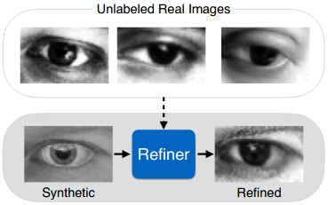
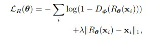
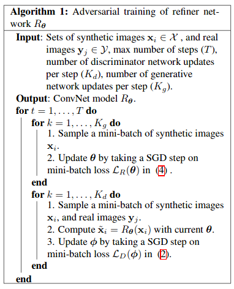
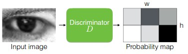

Paper [Link](https://arxiv.org/pdf/1612.07828v1.pdf)
## Abstract
- As data collection with quality annotation is difficult and expensive, it is more viable to use Synthetic images to train models.
- But there is a problem with using synthetic images, a model trained using synthetic images may learn patterns persent only in synthetic images, not in real images as there may be a distribution gap between synthetic and real images.
- To reduce the gap, A GAN based technique is proposed to reduce the gap between synthetic and real images.
- The training data for this SimGAN network is,
    - Real data without annotations/labels
    - Synthetic data
- Collection of the training data is relatively inexpensive compared to obtaining data with quality annotation

## Proposed Approach
- GANs are used to fit/transform a known distribution to a dataset. This is achieved by using 2 networks namely Generator and Disciminator in an adversarial training cycle.
- Generator is used to convert/transform a random point in known distribution to a image. Discriminator is used to discriminate images trained by generator and images in dataset.
- SimGAN is a varient of GAN with Generator input being synthetic images and outputs realistic version of the input sythetic image.
- The objective of the generator is to refine the synthetic images to realistic images. So henceforth, the generator will be termed as refiner.

## Loss Functions
### Discriminator Loss Function
For discriminator, the loss function is cross entropy

- Where x~ represents synthetic refined image and y represent real image. (synthetic refined image : output of refiner with synthetic image as input.
- This is equivalent to cross-entropy error for a two classclassification problem where Dφ(.) is the probability ofthe input being a synthetic image, and1−Dφ(.) that of a real one.
### Refiner
For refiner, the loss function is two loss
- adverarial loss

    - x being synthetic image, Rtheta=refiner, Dphi=Discriminator
    - By minimizing this loss function, the refiner forces thediscriminator to fail classifying the refined images assynthetic
- self-regularization loss
    - l1 norm between refined images and its respective synthetic image.
    - The loss is used to preserve the annotation (for exl; for gaze, the iris/pupil location etc to preserve the gaze direction)
- so the complete loss for refiner is

- lambda is hyper parameter that needs to be tuned.

## Training Algorithm

## Suggested improvements
### Local - adversarial Loss
- The refiner networktends to over-emphasize certain image features to foolthe current discriminator network, leading to driftingand producing artifacts. To reduce the unwanted artifacts in the refined image, a technique is proposed to divide the image in different local patchs. The discriminator is designed to discriminate each local path seperately.

- The loss function is sum of cross-entropy loss of the local patchs.
### History of refined images to train discriminator
-  Another problem of adversarial training is that thediscriminator network only focuses on the latest refinedimages. This may cause (i) diverging of the adversar-ial training, and (ii) the refiner network re-introducingthe artifacts that the discriminator has forgotten about.
-  This problem can be resolved using a buffer of refined images over time. A buffer with size ‘B’ and batch with size ‘b’. At each step, the discriminator is trained on b/2 refined images from the current refiner model, other b/2 images are sampled from this buffer. After refiner is trained in a step, random b/2 images in the buffer will be replaced with the newly refined image.

## Datasets:
- Synthetic images: 1.2M from generated using unity eyes.
- Real images: 214k images from MPIIGaze

## Result
- Visual Turing Test

- Stability

- Mean Error

- **Note: Test set is MPII’s Validation set.**
