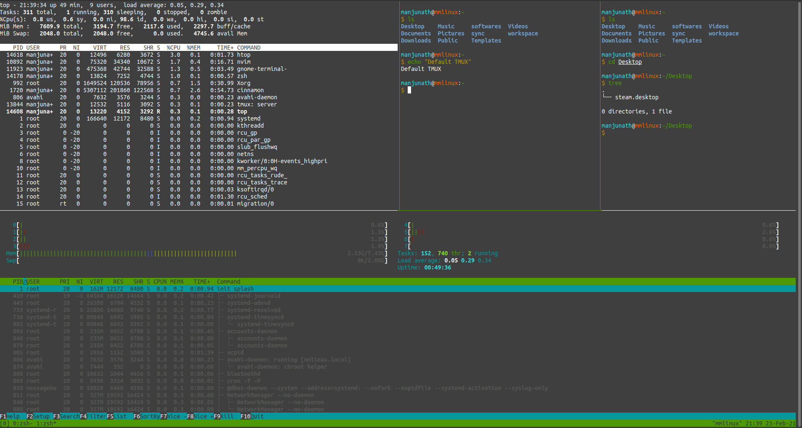
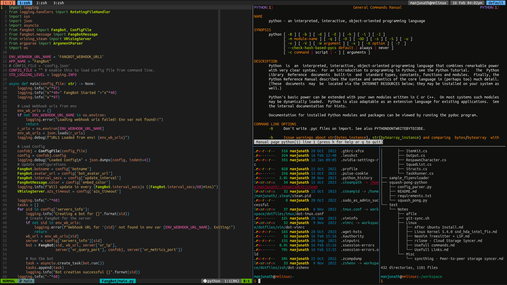
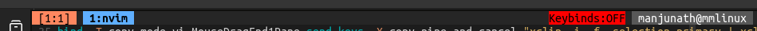

## What is TMUX?

TMUX is a short form for Terminal MUtipleXer. It allows you to switch simply divide up your terminal real estate into tiny pseudo-terminals running it own independent shells.



Features:

1.  **Terminal Sessions** - When you open/run tmux, a tmux session gets created. Each pane you create in the tmux screen gets added to this session. You can leave this session and return to it later, with its state preserved and all the shells (programs) running in that tmux continuing in the background. This is useful for switching seamlessly between projects, as I have one session per project.
    
2.  **Using TMUX on remote machines** - Since TMUX is a shell program, you can use it when SSH'd into a remote machine, allowing you to "multiplex" (open a bunch of shells) from a single SSH connection. If your SSH connection drops, you can SSH back and simply `attach` back to the session you were using before without worrying about your remote apps being stopped.
    

3.  **Terminal app independent** - As TMUX is a terminal multiplexer that runs as a shell app, you can use it in any terminal emulator and utilize its keybinds. This is especially useful if you use multiple terminal emulators for work and personal use.
    
4.  **Session sharing** - Sharing TMUX sessions to collaborate with a colleague in real time - You can share your tmux session with a colleague like sharing the terminal emulator screen. All they have to do is SSH into your machine and connect to your session.
    
5.  **Configurable** - You can also preconfigure sessions, windows, panes, and apps on the pane to your liking without needing to set it up every time.
    

## Install and Using TMUX

On Ubuntu/Debian distros, run `sudo apt install tmux` and confirm if prompted.

To run/start a tmux session, run `tmux`.

Check [this link](https://www.redhat.com/sysadmin/introduction-tmux-linux) as a guide for using tmux.

## My changes and additions to TMUX config

[Cheatsheet for Tmux](https://tmuxcheatsheet.com/)

While default keybinds work for most, I have configured them to work in tandem with my Vim configuration, making it easier to memorize. Additionally, I've themed them according to my liking.
  

You can find my tmux configuration file [here](https://github.com/mnjm/dotfiles/blob/main/tmux/dot-tmux.conf).

Some keybind changes:
- `<ctrl-a>` - TMUX prefix
- `<ctrl-a>c` - Clock mode
- `<ctrl-a>|` - Horizontal split window
- `<ctrl-a>-` - Vertical split window
- `<ctrl-a>t` - Creates new window
- `<alt><Left>` - Go to Left window
- `<alt><Right>` - Go to Right window
- `<ALT>h`  `<ALT>j` `<ALT>k` and `<ALT>l` - Move between panes
- `<ctrl-a>s` - Custom FZF based session selector
- `<ctrl-a>S` - Inbuilt session selector
- Copy mode `y` (yank) - Copy to clipboard
- Copy mode mouse selection - Copy to selection clipboard
- `<ctrl-C>` - reload config
- `F12` - Toggle keybinds - For nested tmux usecase.

You can sideload config file using `tmux -f <config file> ....`

### Custom Session Create / Select using FZF
I find the built-in session selector rather limiting in terms of functionality. Therefore, I've wrote my own session selector based on Fzf. It enables easy switching between TMUX sessions within a few keystrokes and can also spin up a new session if one is not found.
```bash
#!/usr/bin/env zsh
sessions=$(tmux ls 2>/dev/null)
selected=$(echo $sessions | cut -d: -f1 | ~/.fzf/bin/fzf --reverse --no-multi --print-query \
    --preview "tmux capture-pane -pt {}" --preview-window right,90% | tail -n1)
if [ -z "$TMUX" ]; then
    tmux new -As $selected
else
    if  ! tmux has-session -t $selected 2>/dev/null; then
        tmux new -ds $selected
    fi
    tmux switch-client -t $selected
fi
unset sessions selected
```
To use it, save it somewhere accessible to tmux with exec permissions and bind it to a key (with prefix) using
```bash
bind <key> display-popup -h 90% -w 90% -E '<script location>'
```
### Remote Session Keybind Fix

If you use tmux a lot, you'll find yourself in a situation where your tmux sessions are nested. For example, you open a tmux session on the local machine, SSH into a remote machine, and attach/create another tmux session on the remote. In this situation, you cannot send keybinds to the remote machine as they will be intercepted by your local tmux instance.

To fix it, you can press `prefix` (tmux prefix C-b if unchanged) twice and press the key binded with the prefix to send it to the remote session. This only works if you don't have any keys that are globally bounded, that is not bounded with the `prefix` key.

Another solution/workaround for the above problem is disabling (toggling) the `prefix` and root `key-table` on the local machine, so that keybinds will be sent to the remote without getting intercepted by the local tmux instance. How?

Add these lines to your `tmux.conf` file:

```bash
bind -T root F12  \
    set prefix None \;\
    set key-table off \;\
    set @off_mode "Keybinds:OFF" \;\
    refresh-client -S \;\
    display-message -d 2000 -F "Keybinds are OFF"
                
bind -T off F12 \
    set -u prefix \;\
    set -u key-table \;\
    set @off_mode "" \;\
    refresh-client -S \;\
    display-message -d 2000 "Keybinds are ON"
```

The above config changes use `F12` to toggle prefix and key-tables between active and disabled states.  
The state can be displayed using `off_mode` user-defined config variable in the status bar as shown below:

```bash
set -g status-right "#[fg=#000000,bg=#ff0000]#{@off_mode}#[bg=#282828] #[fg=#ffffff,bg=#585858] #(whoami)@#{host_short}
```



## Resources

- [TMUX github](https://github.com/tmux/tmux)
- [Man page](https://www.man7.org/linux/man-pages/man1/tmux.1.html)
- [Guide](https://www.redhat.com/sysadmin/introduction-tmux-linux)
- [My config](https://github.com/mnjm/dotfiles/blob/main/tmux/dot-tmux.conf)
- [Cheatsheet](https://tmuxcheatsheet.com/)
- [Status bar modifications](https://arcolinux.com/everything-you-need-to-know-about-tmux-status-bar/)
