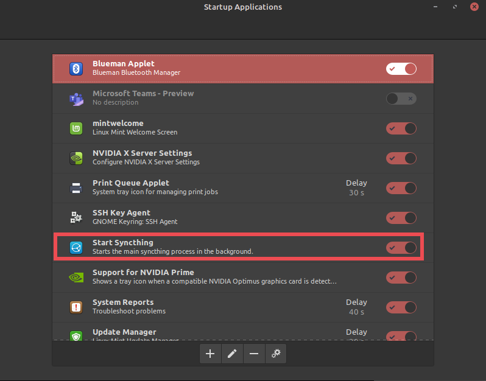
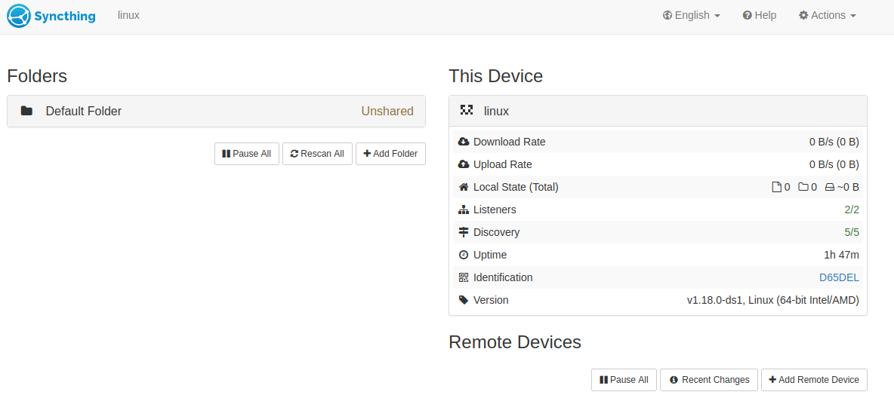
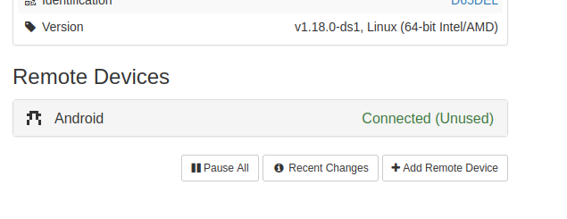

import Callout from "../../../components/Callout.astro";

In this blog, I'll guide you through setting up file syncing between Linux and Android using Syncthing. You can also use this pseudo-guide to set up syncing between other types of machines.

## What is Syncthing?

[Syncthing](https://syncthing.net/) is an open-source decentralized peer-to-peer file synchronization app built using Go lang, with privacy, security, and user control in mind. Its decentralized approach removes the need for relying on any cloud storage.

Syncthing can operate both on LAN and over the internet. It also comes with very easy-to-use, simple (yet powerful) interface and is supported across various platforms. Syncthing is also available as an app on Android. However, it's worth noting that iOS is not supported (reason [here](https://docs.syncthing.net/users/faq.html#is-there-an-ios-client)).

[Here](https://docs.syncthing.net/users/faq.html) is its FAQ that answers many questions that you may have.

## Some details on inner workings of Syncthing

1. When there is a direct connection between syncing devices, like lets say within a LAN, Syncthing simply connects each device with the other and synchronizes files. When there's no direct connection, like lets say over the internet, it uses 'Relay servers' to bounce traffic between sync devices. Therefore, transfer rates are much lower compared to LAN setting. There are many public relay servers available and maintained by the community. You can also host your own private rely servers too.

2. So, Syncthing sometimes relies on 'some server' to sync. What about privacy, you ask? Well, Syncthing uses end-to-end encryption to securely transfer data. Fear not, your data is protected through the power of crytography, and it's open source you can vet the source code for leaks, unlike commercial closed-source solutions.

3. Each device is identified using Syncthing-specific 'Device IDs,' which are unique to each device. While these IDs are unique, they are not sensitive. Only in "very" limited scenarios can a device's IP be reverse-engineered using its ID (when Global discovery is enabled), but it can't be used to connect to your devices or peek over the curtain.

4. Syncthing, similar to many torrenting protocols, divides the files into many chunks, and each chunk is synced between devices at a time. So, like torrents, when you have many devices syncing the same files, transfer rates tend to be faster with load sharing.

## Steps to setting up Syncthing on Linux and Android

### 1 Installation

#### Linux - Ubuntu / Debian based Distributions

Debian-based distributions typically include Syncthing in their `apt` repositories. To install, simply run `sudo apt install syncthing -y`. If it's not available in apt, follow the instructions provided [here](https://apt.syncthing.net/)

#### Android

Syncthing is available both on [Google Play Store](https://play.google.com/store/apps/details?id=com.nutomic.syncthingandroid) and on [F-Droid](https://f-droid.org/packages/com.nutomic.syncthingandroid/). Install it from one of these stores.

#### Non Debian Distros

Prominent distros like Arch and Fedora include Syncthing in their package managers, providing an easy installation. In case it's not available, you can download the binary from [Syncthing's Site](https://syncthing.net/downloads/), extract it, and manually add it to your `PATH`.

#### Windows

Download the installer from [Syncthing's Site](https://syncthing.net/downloads/) and install it like other apps. Grant necessary permissions when prompted, especially firewall permissions.

### 2 Autostart setup

After installation, on Debian/Ubuntu distros, Syncthing usually doesn't get added to autostart by default, so you'd have to do it manually. On Windows, as far as I know, the installer takes care of it.

<Callout icon="edit">
  For Android, check the Syncthing app's optimizations and ensure it has the necessary permissions
  to autostart.
</Callout>

#### Steps to add it to Autostart on Linux Mint

<Callout icon="circle-info">
  I've used Linux Mint for this setup, but these steps shouldn't be much different on other Debian
  distros like Ubuntu.
</Callout>

- Search and open a tool related to auto-start, such as 'Startup Applications,' as shown below.
- Enable "Start Syncthing" if it is not enabled already.
  - If you don't see it listed, find Syncthing's `.desktop` file and add it manually. Use the below command to find it
  - `find /usr/share/applications -name syncthing-start.desktop`

- Either re-login or start Syncthing by using the command `syncthing`.

### 3 Configure Syncthing to Sync a folder sync

**On Linux**

- Open up your browser of choice and go to this URL `http://127.0.0.1:8384/`. You should see something similar to the screenshot below:

- Go to Actions - > Show ID, Copy the ID and send it over to Android

**On Android**

- Install Syncthing from either [Google Play Store](https://play.google.com/store/apps/details?id=com.nutomic.syncthingandroid) or from [F-Droid](https://f-droid.org/packages/com.nutomic.syncthingandroid/), start the app. You should see something similar to the screenshot below:

<Callout icon="circle-info">
  Also, make sure to turn off battery optimization for Syncthing. As it's a file syncing app, it
  requires full permission to run in the background. Don't worry; resource usage is minimal unless
  you're constantly syncing things.
</Callout>

- Go to Devices -> Click `+`, enter the Device ID you copied, and give it a suitable device name.

**On Linux**

- You should see a new message pop up at the top of your browser window, as shown below, displaying the Device ID of the Android device (You can find the Android's Device ID on the Android App by going to its Menu ☰ -> Show Device ID).

- Click "Add Device" and give it a suitable name.
- It should now appear in the Remote Devices Area on both Linux and Android, as shown below.

<Callout icon="edit">
  In the above screenshots, `Linux` and `Windows` represent the labels that I have assigned, not the
  respective Operating systems
</Callout>

- In the Folders section, add a new folder by clicking the `+Add Folder` button.
  - Provide a suitable `Folder Label`
  - **Note down** the `Folder ID`
  - Add the path of the folder you want to sync to the `Folder Path`, for example, `/home/manjunath/workspace/test/sync-folder-in-linux`.

- In `Sharing` tab, Enable the device you want to sync with. In our case, it should be the Android's device label that we gave during pairing process and Click `Save`

**On Android**

- Go to Folders section -> Click `+` button
  - Provide a suitable `Folder Label`
  - Enter the same `Folder ID` from Linux settings that was noted down earlier (In my case its `dr7zy-nauf7`)
  - Enable the Device that you want to Sync with (In my case its `Linux`) and click on the `✓` button as shown below

<Callout icon="bell">
  Thats it! you shoud now have `sync-folder-in-linux` in Linux machine synced with
  `sync-folder-in-android` on Android.
</Callout>

## Addendum

- **To remove sync**, simply remove the folder from the Syncthing GUI / App on one device, but it's recommended to remove it from both.
- **Securing Syncthing Web GUI** - By default, you and others on the same network can access the Syncthing Web GUI if left unprotected. To secure it, set up a **Username** and a Strong **Password**
  - To do that, Go to Actions -> Advanced
  - In GUI Section, provide a Username in `User` section and a Strong Password in `Password` section.

## References

- [Syncthing Docs](https://docs.syncthing.net/)
- [Syncthing Review](https://proprivacy.com/cloud/review/syncthing)
