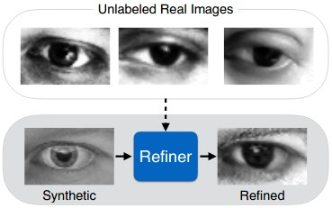
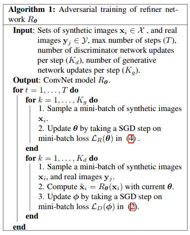

- Paper on SimGAN ([Link](https://arxiv.org/pdf/1612.07828v1.pdf))
- My implementation of SimGAN in TensorFlow 2 ([GitHub link](https://github.com/mnjm/SimGAN))
- Apple blog providing training insights ([Link](https://machinelearning.apple.com/research/gan)).

## Introduction

- As data collection with quality annotation is difficult and expensive, it is more viable to use Synthetic images to train models.
- But there is a problem with using synthetic images, a model trained using synthetic images may learn patterns present only in synthetic images, not in real images as there can be a distribution gap between them.
- To reduce this gap, a GAN-based technique is proposed to "refine" the synthetic samples while retaining their visual features (annotations).
- Collection of synthetic training data is relatively inexpensive compared to obtaining real data with quality annotation.

## Proposed Approach

- GANs are used to fit/transform a known distribution to a dataset. This is achieved by using two networks, namely Generator and Discriminator, in an adversarial training cycle.
- The Generator typically is used to convert/transform a random point (noise) in the known distribution to an image. The Discriminator is used to discriminate images generated by the Generator and images in the dataset.
- SimGAN is a variant of GAN with the Generator input being synthetic images and the output being a realistic version of the input synthetic image.
- The objective of the Generator is to "refine" the synthetic images to realistic ones. Therefore, Generator is referred to as "Refiner".

## Loss Functions

### Discriminator Loss Function

For Discriminator, the loss function is cross entropy

$$
\mathcal{L}_{D}(\phi) = -\sum_ilog(D_{\phi}(\tilde{x}_i)) - \sum_j\log{(1-D_{\phi}(y_j))}
$$

- Where $\tilde{x}_i$ represents refined synthetic images $\tilde{x}_i=R(x_i)$ and $y_j$ represent real images.
- This is equivalent to the cross-entropy error for a binary classification problem where $D*{\phi}(.)$ is the probability of the input being a synthetic image, and $1−D*{\phi}(.)$ is that of a real one.

### Refiner

For the Refiner, the loss function here is made up of two parts:

- Adversarial loss
  - $x*i$ represents synthetic images, $R_\theta$=refiner, $D_\phi$=Discriminator
  - By minimizing this loss function, the Refiner forces the discriminator to fail classifying the refined images as synthetic.

$$
l_{real}(\theta;\tilde{x_i},Y) = -\sum_i(1-D_{\phi}(R_{\theta}(x_i)))
$$

- Self-regularization loss
  - L1 norm between refined images and their respective synthetic input.
  - The loss is used to preserve the annotation (like gaze, the iris/pupil location, etc..)
- So the complete loss for the Refiner is

$$
\mathcal{L}_R(\theta) = -\sum_i\log{(1-D_{\phi}(R_{\theta}(x_i)))} \quad +\lambda||R_{\theta}(x_i)-x_i||_1
$$

- where $\lambda$ is one more hyper parameter to tune.

## Training Algorithm

**Training Loop**

- Train refiner
  - Sample a batch of synthetic images and pass through the refiner.
  - Calculate the refiner loss and update refiner params using SGD on calculated refiner loss.
- Train discriminator
  - Sample a batch of refined synthetic images (using refiner) and real images, then pass them through the discriminator.
  - Assign negative label to refined images and positive label to real images.
  - Calculate the discriminator loss and update discriminator params usig SGD on the calculated loss.
- Repeat for T steps

## Suggested improvements

### Local - adversarial Loss

- The Refiner network tends to over-emphasize certain image features to fool the current Discriminator network, leading to drifting and producing artifacts. To reduce the unwanted artifacts in the refined image, a technique is proposed to divide the image into different local patches. The Discriminator is designed to discriminate each local patch separately.

- The loss function is sum of cross-entropy loss of the local patches.

### History of refined images to train Discriminator

- Another problem of adversarial training is that the Discriminator network only focuses on the latest refined images. This may cause (i) diverging of the adversarial training, and (ii) the Refiner network re-introducing the artifacts that the Discriminator has forgotten about.
- This problem can be resolved using a buffer of refined images over time. A buffer with size ‘B’ and batch with size ‘b’. At each step, the Discriminator is trained on b/2 refined images from the current Refiner model, and the other b/2 images are sampled from this buffer. After the Refiner is trained in a step, random b/2 images in the buffer will be replaced with the newly refined image.

## Datasets

- Synthetic images: 1.2M generated using Unity Eyes.
- Real images: 214k images from MPIIGaze

## Results

- **Visual Turing Test**

A set of randomly shuffled real and refined images was shown to people to differentiate. Above is the confusion matrix of the experiment. This proves that the samples were hard to differentiate.

- **Stability**

- **Mean Error**

A simple CNN model was trained on these refined synthetic images, showcasing better results compared to other models trained using real images
